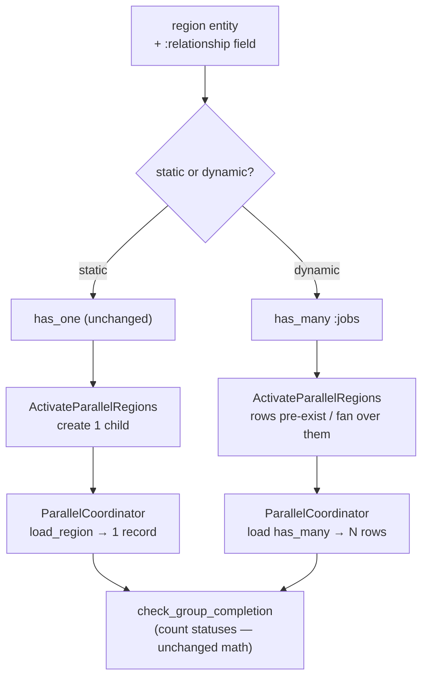

# RFC: Dynamic-cardinality parallel regions

**Status**: Draft **Author**: Barnabas Jovanovics **Created**: 2026-06-15
**Feedback deadline**: TBD

**Stakeholders**:

| Name        | Role       | Reviewed? | Concerns? |
| ----------- | ---------- | --------- | --------- |
| Barnabas J. | Maintainer | [ ]       |           |

## TL;DR

Today a `parallel_region` fans out to a **fixed, compile-time list of named
singletons** — each `region :name, Resource` becomes a `has_one`, and
cardinality is `length(regions)`. This RFC adds a **relationship-sourced
region**: a region whose members are the rows of a `has_many` relationship, so
the fan-out width is determined **at runtime** by the number of related rows.
The completion strategies (`:all` / `:any` / `{:require_n, n}`) already count a
list of statuses, so they generalise to runtime cardinality with their core math
intact; the work is in **activation**, **relationship generation**, the
**coordinator's load path**, and the **verifier**. This is the
`ash_state_machine` half of the workflow DAG engine
([plan](../../../../documentation/plans/workflow-dag-engine.md)).

## Need / problem statement

The consuming workflow model needs to fan out over a runtime-sized set — "a
workflow has N jobs, run each as a parallel region" — where N is parsed from a
workflow file, not known at compile time. The current model can't express it:

- `region :name, Resource` is a compile-time entity; you can't say "one region
  per row of `has_many :jobs`".
- `AddParallelRegionRelationships` always adds a `has_one`
  (`lib/transformers/add_parallel_region_relationships.ex`).
- `ActivateParallelRegions` creates **exactly one** child per named region
  (`Enum.map(regions, …)` in
  `lib/builtin_changes/activate_parallel_regions.ex`).
- `ParallelCoordinator.load_region/3` loads a **single** record via the named
  relationship (`Ash.load!(parent, [region.name])`).

The decisive constraint proven in the code: `{:require_n, n}` is rejected at
compile time when `n > length(branches)` — cardinality is frozen at compile
time.

## Approach / proposed solution

### Overview

Add a second **region mode**. A region is either:

- **static** (today) — `region :name, Resource`, a `has_one`, one child created
  on activation; or
- **dynamic** — `region :name, relationship: :jobs`, sourced from a `has_many`,
  one logical region instance **per related row**, cardinality resolved at
  runtime.

The static path stays byte-for-byte identical; the dynamic path is an additive
dispatch.

### Architecture

### Key design decisions

1. **Region mode is a new optional field, not a new entity.** `region` gains
   `:relationship`; `:resource` becomes optional when a relationship is given
   (`lib/region.ex`, `lib/ash_state_machine.ex` `@region` schema,
   `lib/parallel_region.ex` `@type t`).
2. **Reuse the author's `has_many`.** For a dynamic region we do **not**
   synthesise a relationship — `AddParallelRegionRelationships` uses the
   existing `has_many` the author declared. The rows pre-exist as relationship
   data.
3. **Activation fans over rows, doesn't create singletons.** For a dynamic
   region the child rows already exist (they're the `has_many`);
   `ActivateParallelRegions` activates/readies them rather than creating one per
   named region. The per-region create branch dispatches static vs dynamic.
4. **Completion counts rows.** `ParallelCoordinator` loads the `has_many` and
   maps each row to a status; `check_group_completion/3` is unchanged for `:all`
   / `:any` and only needs `{:require_n, n}` to compare against `count(rows)`
   instead of `length(regions)`.
5. **`{:require_n, n}` validation moves to runtime.** With no compile-time row
   count, `VerifyParallelRegions` can't bound-check `n`; the check becomes a
   runtime `insufficient_completions` result.

### API / interface changes

- New region form: `region :jobs, relationship: :jobs` (resource inferred from
  the relationship destination).
- New public Info functions (see the companion
  [terminal-state-introspection](../user/developer/terminal-state-introspection/README.md)
  feature) so downstream (`ash_jobs`) can build readiness filters.
- No change to the static `region :name, Resource` surface.

### Data model changes

None in the library. The consuming app owns the `has_many` + `parent_id` +
unique-index migrations.

## Benefits

- Expresses runtime-sized fan-out (the workflow DAG's core need) natively.
- The completion math — the trickiest, best-tested part — is reused unchanged.
- Purely additive at the DSL surface; static regions are untouched.

## Alternatives considered

### Alternative 1: N copies of a single resource

A `dynamic_branch Resource, count: fn -> … end`. Rejected: the rows already
exist as relationship data; instantiating "N copies of one resource" duplicates
the model and loses the natural `has_many` the app already has.

### Alternative 2: DAG entirely as app data (no library change)

Hand-roll fan-out/join as Ash resources + Oban triggers in the app, leaving
`ash_state_machine` alone. Rejected for the region primitive: it throws away the
working completion-strategy machinery and re-implements join-with-quorum per
consumer. (The edge/`needs` half **does** stay as data — see the ash_jobs RFC.)

### Do nothing

The workflow DAG engine can't be built; fan-out width stays compile-time.

## Risks and drawbacks

- **High blast radius in `ParallelCoordinator`.** Nearly every private function
  (`load_region`, `fetch_region_states`, `region_status`, the
  `check_group_completion` clauses, `build_complete_result`) gains a
  static/dynamic dispatch. Mitigation: keep the dispatch at the load boundary so
  the strategy math stays single-path.
- **`require_n` guarantee downgrade** (compile error → runtime
  `insufficient_completions`) — intrinsic to dynamic cardinality.
- **`DelegateToRegion` doesn't generalise** — "delegate to region X" is
  ambiguous with many rows; the dynamic path bypasses it in favour of the
  ash_jobs readiness trigger.

## Cross-cutting concerns

- **Security**: no new surface; cycle/deadlock concerns live in the ash_jobs
  `needs` layer.
- **Performance**: completion is recomputed per child terminal event; loading a
  large `has_many` each time is the cost to watch (consider a counter cache
  later).
- **Observability**: a running parent now has a variable number of active
  children (US-DPR-10).
- **Backwards compatibility**: hard requirement — static regions byte-for-byte
  identical (US-DPR-08).

## Open questions

- Do dynamic-region rows pre-exist (app seeds them) or does activation create
  them from a runtime source list? The plan assumes pre-existing rows.
- Should completion use a persisted counter cache to avoid reloading the
  `has_many` on every terminal event?

## References

- [Workflow DAG engine plan](../../../../documentation/plans/workflow-dag-engine.md)
- [workflow-actions-model RFC](../../../../documentation/rfc/workflow-actions-model.md)
- [needs-gated-dag RFC](../../../ash_jobs/documentation/rfc/needs-gated-dag.md)
- Feature stories:
  [dynamic-parallel-regions](../user/developer/dynamic-parallel-regions/README.md),
  [terminal-state-introspection](../user/developer/terminal-state-introspection/README.md)

---

**Last Updated**: 2026-06-15
