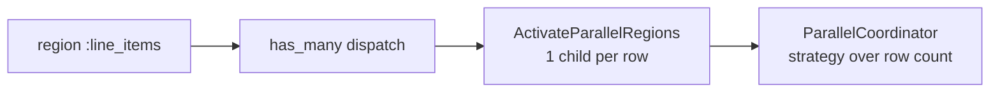

# Dynamic parallel regions — developer documentation

For developers, a dynamic parallel region is a `region` inside `parallel_region`
sourced from a `has_many` relationship rather than a compile-time singleton
`resource`. The DSL stays the same shape, but the fan-out width is decided at
runtime from the related rows. The transformer dispatches a `has_many`, the
activation change creates one child per row, and the coordinator's completion
strategies (`:all`, `:any`, `{:require_n, n}`) reason over the runtime row
count. A verifier still enforces that the relationship destination is an
AshStateMachine resource.

## Stories

| ID        | Story                                                                          | File                                                           |
| --------- | ------------------------------------------------------------------------------ | -------------------------------------------------------------- |
| US-DPR-01 | Declare a region sourced from a `has_many` relationship                        | [US-DPR-01](./US-DPR-01-declare-has-many-region.md)            |
| US-DPR-02 | Fan-out cardinality is determined at runtime by the number of related rows     | [US-DPR-02](./US-DPR-02-runtime-cardinality.md)                |
| US-DPR-03 | `:all` completion succeeds when every related row reaches a success state      | [US-DPR-03](./US-DPR-03-all-completion-succeeds.md)            |
| US-DPR-04 | `:all` completion fails fast when any related row fails                        | [US-DPR-04](./US-DPR-04-all-completion-fails-fast.md)          |
| US-DPR-05 | `:any` completion succeeds on the first related row that succeeds              | [US-DPR-05](./US-DPR-05-any-completion-first-success.md)       |
| US-DPR-06 | `{:require_n, n}` is evaluated against the runtime row count                   | [US-DPR-06](./US-DPR-06-require-n-runtime-count.md)            |
| US-DPR-07 | `{:require_n, n}` is unsatisfiable when too many rows fail                     | [US-DPR-07](./US-DPR-07-require-n-unsatisfiable.md)            |
| US-DPR-08 | A static `region :name, Resource` keeps its has_one semantics (back-compat)    | [US-DPR-08](./US-DPR-08-static-region-backcompat.md)           |
| US-DPR-09 | The verifier rejects a relationship whose destination isn't an AshStateMachine | [US-DPR-09](./US-DPR-09-verifier-rejects-non-state-machine.md) |

## See also

- [dynamic-parallel-regions RFC](../../../rfc/dynamic-parallel-regions.md)
- [Workflow DAG engine plan](../../../../../../documentation/plans/workflow-dag-engine.md)
- [operator view](../../operator/dynamic-parallel-regions/README.md)
- [qa-engineer view](../../qa-engineer/dynamic-parallel-regions/README.md)
