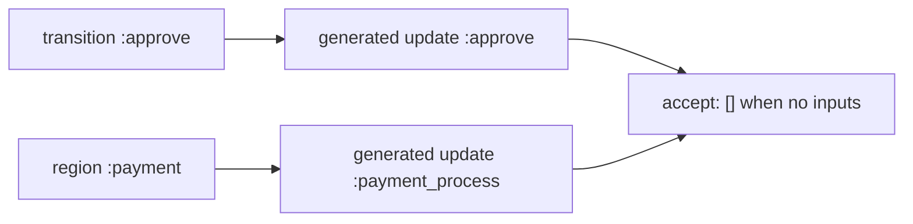

# Generated transition actions — developer documentation

AshStateMachine can generate resource actions from transition definitions and
parallel-region wrapper actions. Developers use these generated actions through
normal Ash action APIs, so they must have the same valid input metadata as
hand-authored actions even when they accept no user inputs.

## Stories

| ID        | Story                                                        | File                                                |
| --------- | ------------------------------------------------------------ | --------------------------------------------------- |
| US-GTA-01 | Transition-generated actions expose empty input metadata     | [US-GTA-01](./US-GTA-01-empty-transition-inputs.md) |
| US-GTA-02 | Region wrapper actions expose empty input metadata           | [US-GTA-02](./US-GTA-02-empty-wrapper-inputs.md)    |

## See also

- [dynamic parallel regions](../dynamic-parallel-regions/README.md)
- [Workflow DAG engine plan](../../../../../../documentation/plans/workflow-dag-engine.md)
