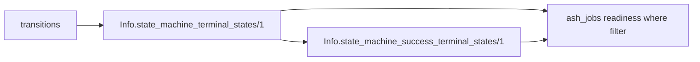

# Terminal-state introspection API — developer documentation

Promote the success/terminal-state derivation currently buried in private
`AshStateMachine.ParallelCoordinator` helpers (`get_success_terminal_states/1`,
`get_all_terminal_states/1`) to public `AshStateMachine.Info` functions
(`state_machine_success_terminal_states/1`, `state_machine_terminal_states/1`),
so a downstream library such as `ash_jobs` can build a needs-readiness `where`
filter against the canonical terminal states instead of re-deriving them from
raw transitions.

## Stories

| ID        | Story                                                                              | File                                                  |
| --------- | ---------------------------------------------------------------------------------- | ----------------------------------------------------- |
| US-TSI-01 | `Info.state_machine_success_terminal_states/1` returns the success terminal states | [US-TSI-01](./US-TSI-01-success-terminal-states.md)   |
| US-TSI-02 | `Info.state_machine_terminal_states/1` returns all terminal states                 | [US-TSI-02](./US-TSI-02-all-terminal-states.md)       |
| US-TSI-03 | The API powers an external readiness filter without re-deriving states             | [US-TSI-03](./US-TSI-03-external-readiness-filter.md) |

## See also

- [dynamic-parallel-regions RFC](../../../rfc/dynamic-parallel-regions.md)
- [Workflow DAG engine plan](../../../../../../documentation/plans/workflow-dag-engine.md)
