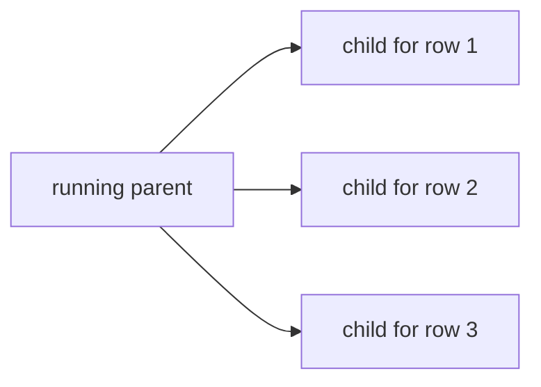

# Dynamic parallel regions — operator documentation

For operators, a dynamic parallel region is observed as a live fan-out: a
running parent spawns one child state machine per related row, and inspecting
the parent while it processes shows that mapping directly. Region state is
surfaced through `get_region_states/2`, so an operator can confirm the running
shape — one active child per row, with no duplicates and no orphans.

## Stories

| ID        | Story                                                           | File                                                 |
| --------- | --------------------------------------------------------------- | ---------------------------------------------------- |
| US-DPR-10 | A running parent shows exactly one active child per related row | [US-DPR-10](./US-DPR-10-one-active-child-per-row.md) |

## See also

- [dynamic-parallel-regions RFC](../../../rfc/dynamic-parallel-regions.md)
- [Workflow DAG engine plan](../../../../../../documentation/plans/workflow-dag-engine.md)
- [developer view](../../developer/dynamic-parallel-regions/README.md)
- [qa-engineer view](../../qa-engineer/dynamic-parallel-regions/README.md)
