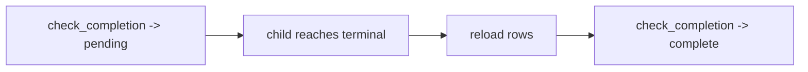

# Dynamic parallel regions — qa-engineer documentation

For QA, the dynamic parallel region is verified through completion: completion
is recomputed on every `check_completion/2` call rather than cached. Each call
reloads the related rows and recomputes their statuses, so a re-entry after a
child reaches a terminal state always evaluates against current data — an early
check returns `{:ok, :pending}` and a later one returns
`{:ok, :complete, context}` once the strategy is satisfied.

## Stories

| ID        | Story                                                               | File                                              |
| --------- | ------------------------------------------------------------------- | ------------------------------------------------- |
| US-DPR-11 | Completion is recomputed each time a child reaches a terminal state | [US-DPR-11](./US-DPR-11-recompute-on-terminal.md) |

## See also

- [dynamic-parallel-regions RFC](../../../rfc/dynamic-parallel-regions.md)
- [Workflow DAG engine plan](../../../../../../documentation/plans/workflow-dag-engine.md)
- [developer view](../../developer/dynamic-parallel-regions/README.md)
- [operator view](../../operator/dynamic-parallel-regions/README.md)
